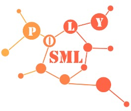
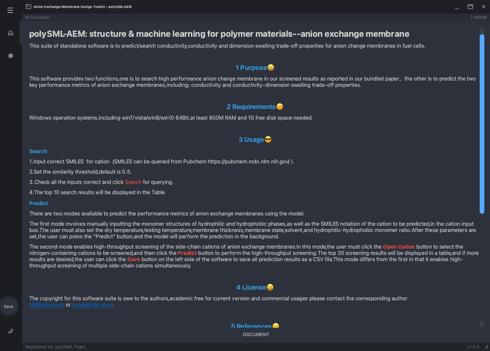
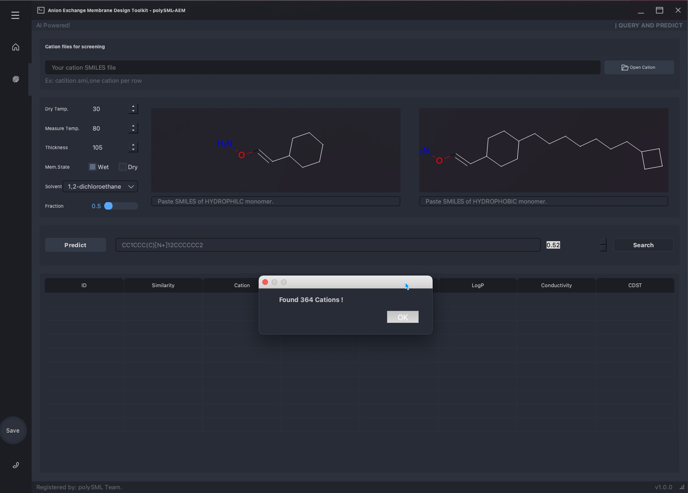
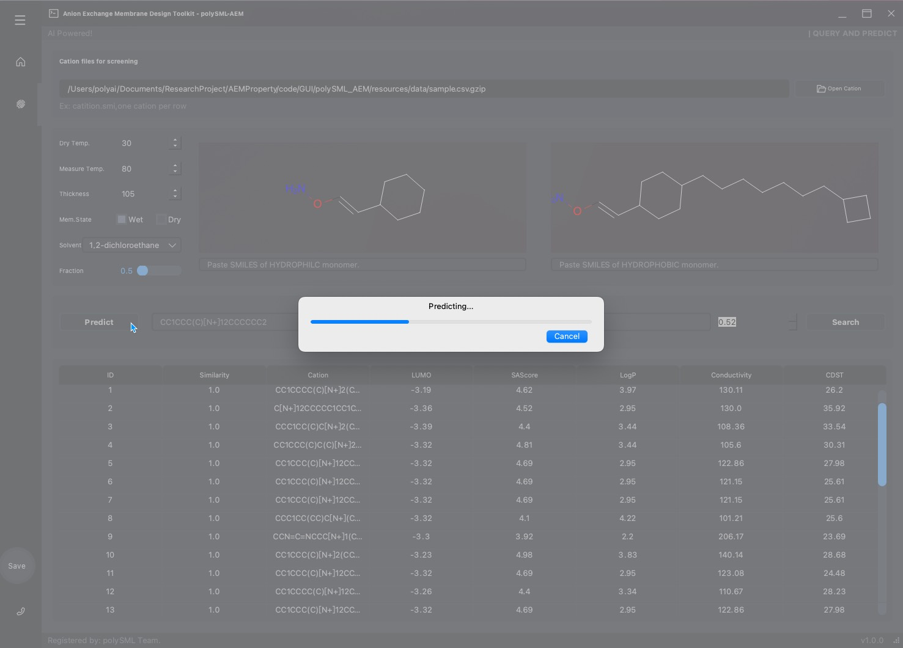
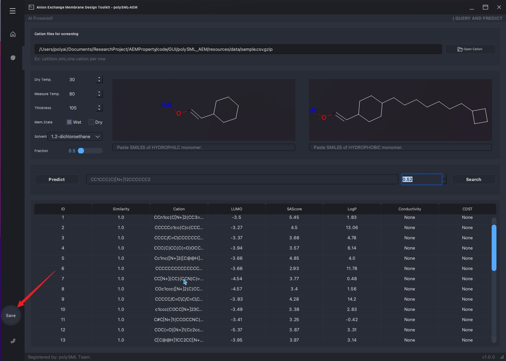

# polySML-AEM: structure & machine learning for polymer materials--anion exchange membrane

This suite of standalone software is to predict/search conductivity, conductivity and dimension swelling trade-off properties for anion change membranes in fuel cells.

## 1 Purpose

This software provides two functions, one is to search high performance anion change membrane in our screened results as reported in our bundled paper，the other is to  predict and  for two key permanence index: conductivity and conductivity and dimension swelling trade-off properties.

## 2 Requirements

Windows operation systems, including win7/vista/win8/win10 **64Bit**, at least 800M RAM and 1G free disk space needed.

## 3 Usage

### 3.1 Search

1. Input correct **SMILES**  for cation  (SMILES can be queried from Pubchem https://pubchem.ncbi.nlm.nih.gov/ ).

2. Set the similarity threshold, default is 0.5.

3. Check all the inputs correct and click **Search** for predictions.

4. The top 10 search result will be displayed in the Table.

### 3.2 Predict

There are two modes available to predict the performance metrics of anion exchange membranes using the model.

The first mode involves manually inputting the monomer structures of hydrophilic and hydrophobic phases, as well as the SMILES notation of the cation to be predicted, in the cation input box. The user must also set the dry temperature, testing temperature, membrane thickness, membrane state, solvent, and hydrophilic-hydrophobic monomer ratio. After these parameters are set, the user can press the "Predict" button, and the model will perform the prediction in the background.

The second mode enables high-throughput screening of the side-chain cations of anion exchange membranes. In this mode, the user must click the "Open Cation" button to select the nitrogen-containing cations to be screened, and then click the "Predict" button to perform the high-throughput screening. The top 30 screening results will be displayed in a table, and if more results are desired, the user can click the "Save" button on the left side of the software to save all prediction results as a CSV file. This mode differs from the first in that it enables high-throughput screening of multiple side-chain cations simultaneously.

### 3.3 Save the results

In addition to displaying the prediction results in tabular form on the software interface, you can also export the results to a common data format (such as CSV or Excel) for subsequent processing if necessary.

## 4 License

The copyright for this software suite is owe to the authors, academic free for current version and commercial usages please contact the corresponding author hfli@ciac.ac.cn, yunqi@ciac.ac.cn.

## 5 References

Users are encouraged to cite the following references for special predictors.

1. Liu LY, Liu TL, Ding F, Zhang H, Zheng JF, Li YQ*, Exploration of the Polarization Curve for Proton-Exchange Membrane Fuel Cells, ACS Appl. Mater.Interfaces, 2021, 13, 49, 58838–58847.

2. Liu T, Liu L, Cui F, Ding F, & Li Y Predict the performance of Polyvinylidene fluoride, ployethersulfone and polysulfone micro/ultra/nano-filtration membranes, 2020, J. Mater. Chem. A, 2020, 8,21862–21871.

3. Liu L, Chen W, Liu T, Kong X, Zheng J, & Li Y Rational design of hydrocarbon-based sulfonated copolymers for proton exchange membranes J. Mater. Chem. A, 2019 7:11847-11857.

4. Liu L, Chen W, & Li Y A Statistical Study of Proton Conduction in Nafion?-based Composite Membranes: Prediction, Filler Selection and Fabrication Methods J. Membr. Sci., 2018 549:393-402.

5. Liu L, Chen W, & Li Y An overview of the proton conductivity of nafion membranes through a statistical analysis J. Membr. Sci., 2016 504:1-9.

## 6 Limitation

Current models mainly focus on the types of polymers and cations reported. For novel materials, chemical structures, predictions are made based on knowledge, confidence needs validation in blind-test. We are not guarantee the prediction is fully accurate but guidelines are possible.

## 7 Bug report and suggestions

Please contact either lyliu@ciac.ac.cn or yunqi@ciac.ac.cn for bugs or suggestions.

## 8 About us

We are a research group dedicated in structure and machine learning study on polymer materials. We are welcoming suggestions and collaborations. Contact Prof.Hong fei Li or Yunqi Li for further information.

